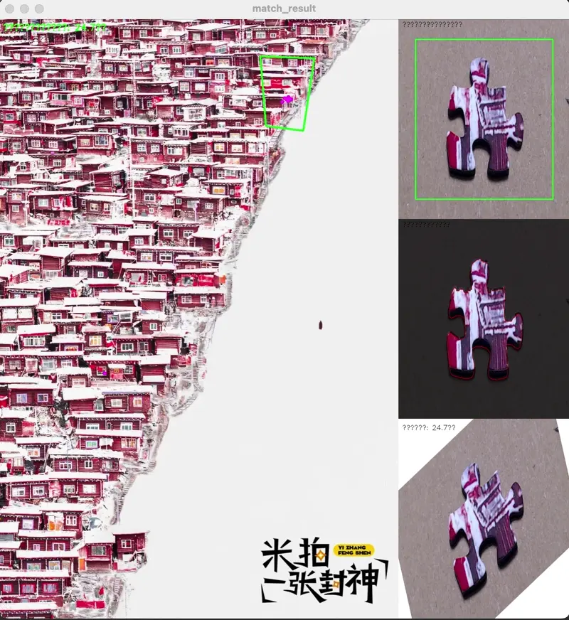
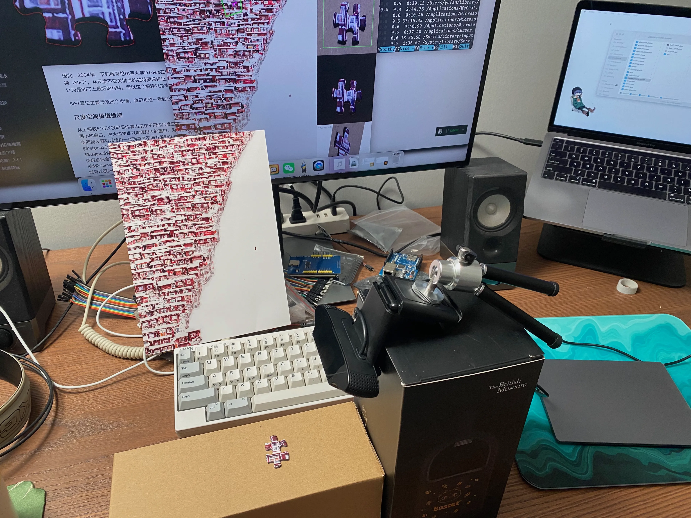

# JigSight 拼图辅助

基于计算机视觉的拼图辅助系统，帮助用户快速找到拼图碎片在原图中的位置和<del>正确的</del>旋转角度。

## 功能特点

- 实时摄像头捕获拼图碎片
- 使用 SIFT 算法进行特征匹配
- 自动计算拼图碎片的旋转角度<del>，别管对不对了</del>
- 显示处理过程

## 怎样使用

预先准备：

- 拼图的原图
- 摄像头
- 一个和拼图有明显区分的背景，最好是纯色的
- 最好有一个和完成品比例一致的印刷版参考图

这只是个 MVP，你可能需要掌握一点点 Python 知识。

- 在 `src.main.main` 中修改原图 `base_img` 的路径
- 如果你有多个摄像头，在 `src.main.main` 中修改摄像头的索引 `camera_index`
- 启动 `main.py`

主窗口分为四个区域：

- 左侧：显示原图并使用紫色圆点和绿色框标记匹配区域
- 右上：摄像头实时捕获的画面
- 右中：带掩膜的拼图片
- 右下：匹配成功时显示<del>正确</del>旋转后的拼图片

调试：

- 如果拼图片的掩膜计算效果不佳，调整 `src.camera.create_mask` 的几个参数
- 手动调整摄像头的焦距、感光度、快门速度等参数能够获得更稳定的结果
- 如果你的拼图缺乏特征点（就像我这个的右半边一样），建议使用基于边缘匹配的方案，如 [Kawaboongawa / Zolver](https://github.com/Kawaboongawa/Zolver)

## 故事

我购入的这款 500 片拼图名为《色达雪景》，原图来自米拍摄影社区的摄影师 Rarobin。

色达县是中国四川省甘孜藏族自治州辖县，位于甘孜州东北部，面积 9338.98 平方公里。常住人口 64681 人，「色达」一词意为「金马」。
